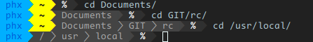

pwrln
=====

A WiP powerline prompt generator



```sh
# edit config.h and main.c if you want
make
make install
PS1='$(pwrln $?)'
```

To generate prompt for specific shell append its name delimited by `-`
to `pwrln` executable name e.g. `pwrln-bash`, `pwrln-ksh`, ...

```sh
# rename pwrln binary
mv pwrln pwrln-ksh
# or create symlink
ln -s pwrln pwrln-ksh
```

`make install` creates symlinks for all supported shells.


## Shell support

Generating prompt for specific shell boils down to applying proper
escape code delimiters, so that its input manager (e.g. `readline`)
takes into account only printable characters when estimating prompt
length.

Shells recognised by `pwrln` so far:
 - bash
 - ksh
 - zsh

before adding entries to your shell config adjust the code to your
liking (see [Customisation](#customisation)) and install it with:

```sh
% make
# make install
```

### bash

Add those lines to `.bashrc`:

```sh
PS1='$(pwrln-bash $?)'
export PS1
```

Notice `'` single-quote marks.

### ksh

Roughly the same case as with bash.
Add those lines to `.kshrc` or `.mkshrc` or `.profile` or whatever:

```sh
PS1='$(pwrln-ksh $?)'
export PS1
```

Notice `'` single-quote marks.


### zsh

Add those lines to `.zshrc`:

```sh
precmd()
{
	export PROMPT="$(pwrln-zsh $?)"
}
```


## Customisation

Change colours and glyphs (special characters) in `config.h`.

If your font does not display fancy characters like that
powerline arrow you might replace them with any string
(e.g. empty string):

```c
static const char glyph_delimiter[] = "";
static const char glyph_subdelimiter[] = ">";
```

In `main.c` a linked list of elements representing prompt
segments is assembled.
Those segments can be swapped, removed etc.

Creating custom segments is straightforward:

```c
/*                               font colour -------------+
                              background colour -----+    |
                                                     |    |   */
tail(prompt_chain)->next = new("my custom segment", 238, 248);

/* tail(first_segment) returns last segment in chain */
```
